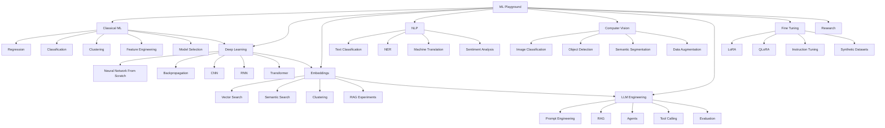
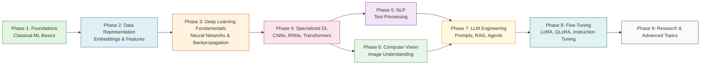

# AI Research Lab — Your Personal AI Encyclopedia & Laboratory

<!-- BADGES -->

---

## ⚡ Powered By Self-Hosted AI Infrastructure

> **This entire repository — structure, documentation, educational content, and learning roadmap — was generated by a self-hosted AI system.**

### The Infrastructure Behind This Knowledge Base

| Component | Details |
|-----------|---------|
| **Framework** | [ai-self-hosted-hw](https://github.com/MarceloSerra/ai-self-hosted-hw) — Self-hosted hardware for AI inference and development |
| **Model** | [Unsloth/Qwen3.6 27B Q2_K_XL](https://huggingface.co/unsloth/Qwen3.6-27B-instruct-2507-q4_k_s) — Quantized Qwen3.6 27B parameter model via Unsloth optimization |
| **Quantization** | Q2_K_XL (GGUF format) — Extreme quantization for efficient local inference on consumer hardware |
| **Approach** | Local-first, self-hosted AI — No cloud APIs, no external dependencies |

### Why This Matters

This repository demonstrates a critical principle: **self-hosted AI infrastructure can produce structured, high-quality knowledge systems autonomously.**

The same framework that powers this encyclopedia ([ai-self-hosted-hw](https://github.com/MarceloSerra/ai-self-hosted-hw)) enables:
- Local LLM inference without cloud dependencies
- Quantized models running on consumer hardware
- Autonomous repository generation and documentation
- Self-contained AI development workflows

This is not just a learning resource — it's proof that self-hosted AI infrastructure works at scale.

### Learn More About the Infrastructure

- **[ai-self-hosted-hw](https://github.com/MarceloSerra/ai-self-hosted-hw)** → Full framework documentation and setup guides
- **[Unsloth](https://github.com/unslothai/unsloth)** → Optimized LLM inference for efficient local deployment
- **Qwen3.6 27B** → State-of-the-art open-source language model

---

> A structured learning and reference system for Machine Learning, Deep Learning, LLM Engineering, and AI Research. Not just experiments — a curriculum you can navigate from beginner to expert.

## What This Repository Is

Every directory in this repository teaches you:

1. **What this field is** — Clear definitions
2. **What problems it solves** — Practical value
3. **When to use it** — Decision guidance
4. **When NOT to use it** — Common mistakes and anti-patterns
5. **Real-world examples** — Industry applications
6. **Practical projects** — Hands-on experiments
7. **Relationships with other fields** — How topics connect

Look at a problem, identify the technique, find the path.

---

## Problem → Technique Decision Tree

| I have this kind of problem... | Start here | Then explore |
|-------------------------------|------------|--------------|
| Categorizing emails, spam detection | [Classification](classical_ml/classification/README.md) | [NLP Text Classification](nlp/text-classification/README.md) |
| Predicting prices, sales, trends | [Regression](classical_ml/regression/README.md) | Deep Learning for complex patterns |
| Finding similar products/documents | [Vector Search](embeddings/vector-search/README.md) | [Semantic Search](embeddings/semantic-search/README.md) |
| Building a chatbot with company knowledge | [RAG](llm/rag/README.md) | [Embeddings RAG Experiments](embeddings/rag-experiments/README.md) |
| Recognizing objects in images | [Object Detection](computer_vision/object-detection/README.md) | CNNs, semantic segmentation |
| Customizing an LLM for my domain | [Instruction Tuning](fine_tuning/instruction-tuning/README.md) | LoRA, QLoRA |
| Grouping customers, discovering patterns | [Clustering](classical_ml/clustering-unsupervised/README.md) | [Embedding Clustering](embeddings/clustering/README.md) |
| Understanding text sentiment | [Sentiment Analysis](nlp/sentiment-analysis/README.md) | LLM-based analysis |
| Translating between languages | [Machine Translation](nlp/machine-translation/README.md) | Transformer architectures |
| Building autonomous AI agents | [LLM Agents](llm/agents/README.md) | Tool calling, evaluation |

---

## Repository Structure

---

## Learning Roadmap

### Phase Details

| Phase | Topics | Prerequisites | Estimated Time |
|-------|--------|---------------|----------------|
| **1. Foundations** | Regression, Classification, Clustering, Feature Engineering, Model Selection | Python basics | 2-3 weeks |
| **2. Data Representation** | Embeddings, Vector Search, Semantic Search | Phase 1 | 1-2 weeks |
| **3. DL Fundamentals** | Neural Networks from Scratch, Backpropagation | Phase 1, 2 | 2-4 weeks |
| **4. Specialized DL** | CNNs, RNNs, Transformers | Phase 3 | 3-4 weeks |
| **5. NLP** | Text Classification, NER, Translation, Sentiment | Phase 2, 4 | 2-3 weeks |
| **6. Computer Vision** | Image Classification, Object Detection, Segmentation | Phase 4 | 2-3 weeks |
| **7. LLM Engineering** | Prompt Engineering, RAG, Agents, Tool Calling, Evaluation | Phase 2, 4 | 3-4 weeks |
| **8. Fine-Tuning** | LoRA, QLoRA, Instruction Tuning, Synthetic Datasets | Phase 7 | 2-3 weeks |
| **9. Research** | Project templates, experiments, reports | All phases | Ongoing |

---

## Quick Navigation

### Core Disciplines
- [Classical ML](classical_ml/README.md) — The foundation everything builds on
- [Deep Learning](deep_learning/README.md) — Neural networks that power modern AI
- [Embeddings](embeddings/README.md) — Dense vectors: the connective tissue of AI
- [NLP](nlp/README.md) — Language understanding and generation
- [Computer Vision](computer_vision/README.md) — Teaching machines to see
- [LLM Engineering](llm/README.md) — Building with large language models
- [Fine Tuning](fine_tuning/README.md) — Customizing models for your domain

### Supporting Infrastructure
- [Datasets](datasets/README.md) — Data collection and management
- [Notebooks](notebooks/README.md) — Interactive exploration
- [Experiments](experiments/README.md) — Structured experimentation
- [Reports](reports/README.md) — Results documentation
- [Tools](tools/README.md) — Utilities and helpers
- [Research](research/README.md) — Project templates and advanced work

### Documentation
- [Learning Roadmap](docs/learning-roadmap.md) — Progressive learning path
- [Architecture](docs/architecture.md) — Repository design decisions
- [Git Conventions](docs/git-conventions.md) — Commit and branch standards

---

## How to Use This Repository

1. **Identify your problem** — Use the decision tree above
2. **Navigate to the relevant section** — Follow links from this README
3. **Read the README** — Understand what, why, when, and when not
4. **Try a practical project** — Each section includes hands-on experiments
5. **Document your results** — Use [Reports](reports/README.md) and [Experiments](experiments/README.md)

---

## Difficulty Levels

- 🟢 **Beginner** — Start here, foundational concepts
- 🟡 **Intermediate** — Requires understanding of prerequisites
- 🔴 **Advanced** — Deep technical knowledge required

---

## Credits & Infrastructure

This repository was autonomously generated using self-hosted AI infrastructure. The entire structure, documentation, educational content, and learning roadmap were produced without cloud APIs or external services.

### Built With

| Component | Link | Description |
|-----------|------|-------------|
| **ai-self-hosted-hw** | [GitHub](https://github.com/MarceloSerra/ai-self-hosted-hw) | Self-hosted hardware framework for AI inference and development — the foundation of this project |
| **Unsloth/Qwen3.6 27B Q2_K_XL** | [HuggingFace](https://huggingface.co/unsloth/Qwen3.6-27B-instruct-2507-q4_k_s) | Quantized 27B parameter model optimized for efficient local inference on consumer hardware |
| **Unsloth** | [GitHub](https://github.com/unslothai/unsloth) | Fast LLM fine-tuning and inference optimization framework |

### The Philosophy

This repository exists to prove a point: **self-hosted AI infrastructure is viable, practical, and capable of producing structured knowledge systems at scale.**

By running locally — without cloud dependencies, API costs, or external services — this encyclopedia demonstrates that:
- Local LLMs can generate comprehensive technical documentation
- Quantized models maintain quality while running on consumer hardware
- Self-hosted workflows enable autonomous AI development
- Open-source infrastructure empowers independent knowledge creation

The [ai-self-hosted-hw](https://github.com/MarceloSerra/ai-self-hosted-hw) framework makes this possible. Explore it to build your own self-hosted AI systems.

### License

This repository is available under the MIT License. See [LICENSE](LICENSE) for details.
