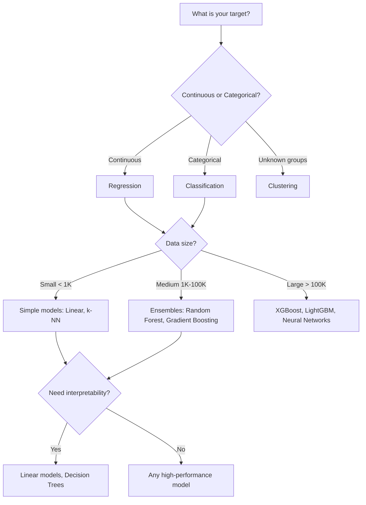

# Model Selection

## What is it?
Model selection is the process of choosing the best algorithm and configuration for your specific problem. It's not about using the most complex model — it's about finding the right fit.

## Why does it exist?
No single algorithm wins all competitions. Different problems require different approaches:
- Data size affects which models work well
- Feature types matter (numeric, categorical, text)
- Performance requirements vary (speed vs accuracy tradeoff)

## Selection Framework

## Validation Methods

| Method | Use When | Tradeoff |
|--------|----------|----------|
| Train/Test Split | Quick baseline | Single split may be unlucky |
| k-Fold Cross-Validation | Standard evaluation | k times slower training |
| Stratified k-Fold | Imbalanced classes | Preserves class distribution |
| Time Series Split | Temporal data | Prevents future leakage |

## Common Pitfalls
1. **Overfitting** — Model memorizes training data, fails on new data
2. **Data Leakage** — Future information accidentally in training data
3. **Ignoring baseline** — Not comparing against simple approaches first
4. **Chasing metrics** — Optimizing for numbers that don't matter to the business

## Related Topics
- [Regression](../regression/README.md) — Regression model selection
- [Classification](../classification/README.md) — Classifier comparison
- [Feature Engineering](../feature-engineering/README.md) — Prerequisite step

## Practical Project Ideas
1. Compare 5 classifiers on the same dataset, rank by F1 score
2. Use cross-validation to find optimal k for k-NN
3. Build a pipeline: preprocessing → model selection → evaluation
4. Implement early stopping to prevent overfitting

---

Difficulty Level: 🟡 Intermediate
