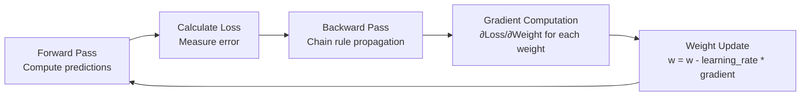

# Backpropagation

## What is it?
Backpropagation is the algorithm that makes neural networks learn. It computes how each weight in the network contributed to the error, then updates weights to reduce that error. Without backpropagation, deep learning doesn't exist.

## Why does it exist?
The fundamental problem: A neural network has millions of weights. How do we know which weights to change, by how much, and in which direction?

Backpropagation answers this using the **chain rule** from calculus — propagating error signals backward through the network layer by layer.

## What problems become solvable because of backpropagation?

Without backpropagation:
- ❌ We could not train deep networks with many layers
- ❌ Image recognition at scale would be impossible
- ❌ Language models (including LLMs) would not exist
- ❌ Any complex pattern learning requiring layered representations would fail

With backpropagation:
- ✅ Deep networks learn hierarchical features automatically
- ✅ Each layer learns what it should represent to minimize error
- ✅ Networks with billions of parameters become trainable
- ✅ Modern AI — from AlphaGo to GPT — becomes possible

## How It Works

## Key Concepts

| Concept | Description |
|---------|-------------|
| Gradient Descent | Optimization method using gradients |
| Learning Rate | Step size for weight updates — too fast diverges, too slow stalls |
| Chain Rule | Mathematical foundation enabling error propagation |
| Vanishing Gradients | Problem where early layers get tiny updates (solved by ReLU, residual connections) |

## When should I use it?
- Understanding how any neural network learns internally
- Implementing custom training loops
- Debugging training failures
- Building frameworks or educational tools

## When should I NOT use it?
- Manual implementation for production → Use framework autograd (PyTorch, TensorFlow)
- Simple models where analytical solutions exist

## Related Topics
- [Neural Network From Scratch](../neural-network-from-scratch/README.md) — Uses backpropagation to learn
- [CNN](../cnn/README.md) — CNNs train using backpropagation
- [Transformer](../transformer/README.md) — Transformers trained via backpropagation

## Practical Project Ideas
1. Implement backpropagation by hand for a 2-layer network
2. Visualize how gradients flow through layers during training
3. Experiment with learning rates and observe convergence behavior
4. Compare gradient descent variants: SGD, Adam, RMSProp

---

Difficulty Level: 🔴 Advanced
