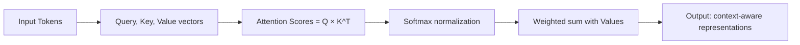

# Transformer

## What is it?
The Transformer is a neural network architecture based entirely on attention mechanisms — no recurrence, no convolution. It powers every modern LLM (GPT, Claude, Gemini) and has revolutionized AI.

## Why does it exist?
RNNs had fundamental limitations:
- **Sequential processing** — Can't parallelize training
- **Vanishing gradients** — Struggle with long sequences
- **Limited context** — Hidden state compresses all history into fixed vector

Transformers solve these with **self-attention**: every position can directly attend to every other position.

## Core Concepts

| Concept | Purpose | Description |
|---------|----------|-------------|
| Self-Attention | Connect any two positions | "For each word, how much should I pay attention to every other word?" |
| Multi-Head Attention | Multiple attention patterns simultaneously | Different heads learn different relationships |
| Positional Encoding | Inject sequence order information | Without recurrence, position must be explicit |
| Encoder-Decoder | Separate understanding and generation | Encoder processes input, decoder generates output |

## The Attention Mechanism

## When should I use it?
- Language modeling and generation
- Sequence-to-sequence tasks (translation, summarization)
- Any task requiring long-range dependency modeling
- Parallelizable training is important

## When should I NOT use it?
- Very short sequences where simpler models suffice
- Computational constraints — Transformers are expensive
- Real-time streaming with infinite sequences → Consider RNN variants

## Related Topics
- [LLM Engineering](../../llm/README.md) — LLMs are Transformer-based
- [Fine Tuning](../../fine_tuning/README.md) — Customize pre-trained Transformers
- [NLP](../../nlp/README.md) — Primary application domain

## Practical Project Ideas
1. Implement a simple Transformer from scratch (attention mechanism only)
2. Fine-tune a pre-transformer for text classification
3. Visualize attention patterns to understand what the model learns

---

Difficulty Level: 🔴 Advanced
