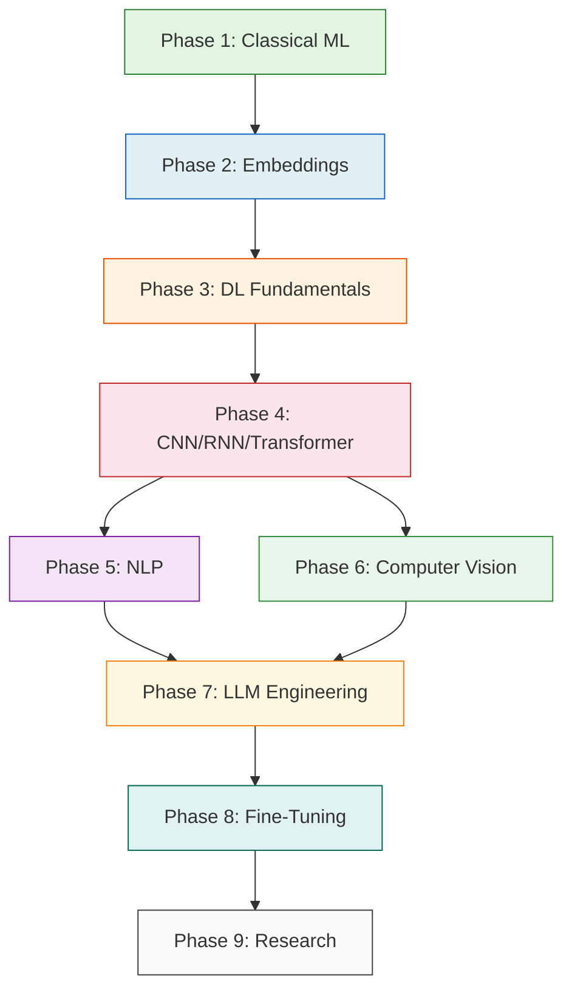

# Learning Roadmap

Progressive path from beginner to expert through AI and Machine Learning.

## Phase 1: Foundations — Classical ML Basics (2-3 weeks)

Build your foundation with classical machine learning before diving into deep learning.

**Topics:**
1. [Regression](../classical_ml/regression/README.md) — Predicting continuous values
2. [Classification](../classical_ml/classification/README.md) — Categorizing data
3. [Clustering](../classical_ml/clustering-unsupervised/README.md) — Finding groups without labels
4. [Feature Engineering](../classical_ml/feature-engineering/README.md) — Creating better inputs
5. [Model Selection](../classical_ml/model-selection/README.md) — Choosing the right approach

**Key Concepts:** Supervised vs unsupervised learning, train/test split, cross-validation, overfitting, bias-variance tradeoff.

## Phase 2: Data Representation — Embeddings & Features (1-2 weeks)

Learn how modern AI represents information as dense vectors.

**Topics:**
1. [Embeddings](../embeddings/README.md) — Dense vector representations
2. [Vector Search](../embeddings/vector-search/README.md) — Finding nearest neighbors
3. [Semantic Search](../embeddings/semantic-search/README.md) — Meaning-based retrieval
4. [Clustering](../embeddings/clustering/README.md) — Grouping similar embeddings

**Key Concepts:** Dense vectors, similarity metrics (cosine, Euclidean), dimensionality reduction.

## Phase 3: Deep Learning Fundamentals (2-4 weeks)

Understand how neural networks learn from data.

**Topics:**
1. [Neural Network From Scratch](../deep_learning/neural-network-from-scratch/README.md) — Building without frameworks
2. [Backpropagation](../deep_learning/backpropagation/README.md) — How networks actually learn
3. Activation functions, loss functions, optimizers

**Key Concepts:** Forward pass, backward pass, gradient descent, learning rate, weight initialization.

## Phase 4: Specialized DL Architectures (3-4 weeks)

Specialized network architectures for different data types.

**Topics:**
1. [CNN](../deep_learning/cnn/README.md) — Convolutional networks for images
2. [RNN](../deep_learning/rnn/README.md) — Recurrent networks for sequences
3. [Transformer](../deep_learning/transformer/README.md) — Attention-based architecture

**Key Concepts:** Convolutions, pooling, vanishing gradients, self-attention, positional encoding.

## Phase 5: NLP — Text Processing (2-3 weeks)

Apply ML and DL to language understanding.

**Topics:**
1. [Text Classification](../nlp/text-classification/README.md) — Categorizing text
2. [Named Entity Recognition](../nlp/named-entity-recognition/README.md) — Extracting entities
3. [Sentiment Analysis](../nlp/sentiment-analysis/README.md) — Understanding opinions
4. [Machine Translation](../nlp/machine-translation/README.md) — Translating languages

**Prerequisites:** Phase 2 (Embeddings), Phase 4 (Transformers, RNNs)

## Phase 6: Computer Vision — Image Understanding (2-3 weeks)

Apply ML and DL to visual data.

**Topics:**
1. [Image Classification](../computer_vision/image-classification/README.md) — Categorizing images
2. [Object Detection](../computer_vision/object-detection/README.md) — Finding objects in images
3. [Semantic Segmentation](../computer_vision/semantic-segmentation/README.md) — Pixel-level classification
4. [Data Augmentation](../computer_vision/data-augmentation/README.md) — Expanding training data

**Prerequisites:** Phase 4 (CNNs)

## Phase 7: LLM Engineering (3-4 weeks)

Build practical applications with large language models.

**Topics:**
1. [Prompt Engineering](../llm/prompt-engineering/README.md) — Designing effective prompts
2. [RAG](../llm/rag/README.md) — Retrieval Augmented Generation
3. [Agents](../llm/agents/README.md) — Autonomous AI agents
4. [Tool Calling](../llm/tool-calling/README.md) — Giving LLMs capabilities
5. [Evaluation](../llm/evaluation/README.md) — Measuring LLM performance

**Prerequisites:** Phase 2 (Embeddings), Phase 4 (Transformers)

## Phase 8: Fine-Tuning (2-3 weeks)

Customize pre-trained models for your domain.

**Topics:**
1. [LoRA](../fine_tuning/lora/README.md) — Low-Rank Adaptation
2. [QLoRA](../fine_tuning/qlora/README.md) — Quantized LoRA
3. [Instruction Tuning](../fine_tuning/instruction-tuning/README.md) — Aligning to instructions
4. [Synthetic Datasets](../fine_tuning/synthetic-datasets/README.md) — Generating training data

**Prerequisites:** Phase 7 (LLM Engineering), GPU access recommended

## Phase 9: Research & Advanced Topics (Ongoing)

Apply everything you've learned to real research projects.

**Topics:**
- [Research Templates](../research/README.md) — Structured project methodology
- Experiment design, reproducibility, reporting results
- Literature review and staying current

---

## Visual Roadmap

