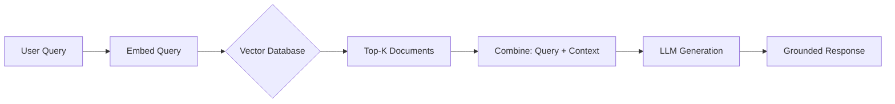

# RAG Experiments

## What is it?
Retrieval Augmented Generation (RAG) combines retrieval-based search with generative AI. Instead of relying solely on an LLM's training data, RAG fetches relevant documents and provides them as context for generation.

## Why does it exist?
LLMs have fundamental limitations:
- **Knowledge cutoff** — Training data has a fixed date
- **Hallucination** — Models invent false information confidently
- **Domain specificity** — General models lack specialized knowledge
- **Transparency** — Can't cite sources for answers

RAG solves these by grounding responses in retrieved, verifiable documents.

## Architecture

## When should I use it?
- Building chatbots with company/product knowledge
- Q&A systems over documentation or manuals
- Research assistants that cite sources
- Any application requiring factual, verifiable answers

## When should I NOT use it?
- Creative writing where hallucination is acceptable
- Simple Q&A already in the model's training data
- Very low-latency requirements (retrieval adds delay)
- Small knowledge bases that fit in context window directly

## Related Topics
- [Semantic Search](../semantic-search/README.md) — Powers RAG retrieval
- [LLM RAG](../../llm/rag/README.md) — Full LLM-focused RAG guide
- [Vector Search](../vector-search/README.md) — Underlying search mechanism

## Practical Project Ideas
1. Build a FAQ chatbot over your project documentation
2. Create a research assistant that cites sources
3. Implement multi-document summarization with retrieval
4. Compare RAG quality with and without query rewriting

---

Difficulty Level: 🔴 Advanced
