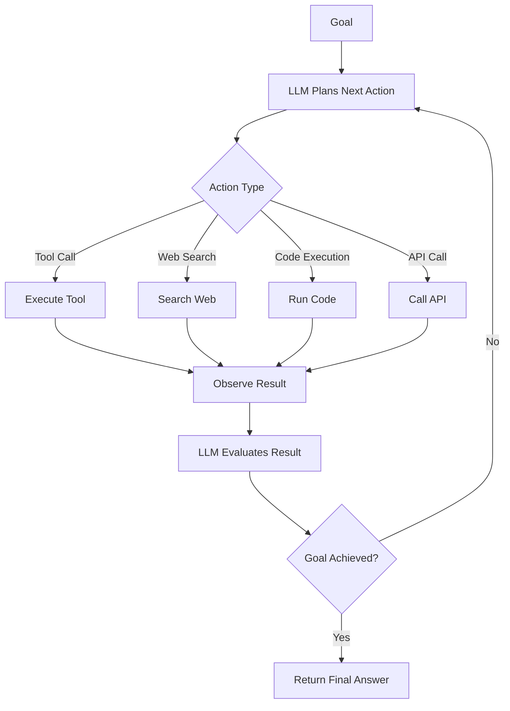

# Agents

## What is it?
LLM Agents are autonomous systems that use language models as reasoning engines to plan, execute actions, and achieve goals. Unlike simple chatbots, agents take actions in the world — calling tools, browsing web, writing code, or interacting with APIs.

## Why does it exist?
Single LLM calls have limitations:
- Can't access real-time information without retrieval
- Can't execute code or interact with systems directly
- Struggle with multi-step complex tasks without memory
- Need feedback loops to correct mistakes

Agents solve these by combining LLM reasoning with action execution.

## Core Architecture

## Agent Types

| Type | Description | Use Case |
|------|-------------|----------|
| Single-Agent | One LLM with tool access | Simple automation tasks |
| Multi-Agent | Multiple specialized agents collaborating | Complex workflows |
| ReAct Agent | Reason + Act loop | Exploration and problem-solving |
| Planning Agent | Decomposes goals into subtasks | Project management, research |

## When should I use it?
- Automating multi-step workflows
- Tasks requiring external tool interaction
- Research and information gathering across sources
- Complex problem-solving with feedback loops

## When should I NOT use it?
- Simple single-step tasks → Direct LLM call is faster/cheaper
- High-reliability requirements — agents can fail unpredictably
- Real-time latency constraints — agent loops add delay
- Tasks where deterministic code suffices

## Related Topics
- [Tool Calling](../tool-calling/README.md) — How agents interact with systems
- [RAG](../rag/README.md) — Agents often use retrieval for knowledge
- [Evaluation](../evaluation/README.md) — Measuring agent performance is challenging

## Practical Project Ideas
1. Build a web research agent that summarizes topics
2. Create a code debugging agent that fixes errors iteratively
3. Design a multi-agent system for project planning and execution
4. Implement an agent that automates data analysis workflows

---

Difficulty Level: 🔴 Advanced
