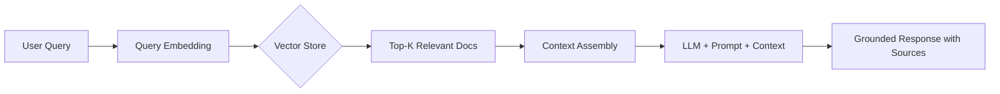

# RAG (Retrieval Augmented Generation)

## What is it?
RAG combines retrieval of external knowledge with LLM generation. Instead of relying on the model's training data, RAG fetches relevant documents and provides them as context for accurate, grounded responses.

## Why does it exist?
LLMs have critical limitations that RAG solves:
- **Knowledge cutoff** — Training data has a fixed date; RAG accesses current information
- **Hallucination** — Models invent facts; RAG grounds answers in retrieved documents
- **Domain specificity** — General models lack specialized knowledge; RAG adds it
- **Source citation** — Users need to verify answers; RAG provides document references

## Architecture

## Key Components

| Component | Purpose | Options |
|-----------|----------|---------|
| Embedding Model | Convert text to vectors | Sentence Transformers, OpenAI embeddings |
| Vector Database | Store and search vectors | Pinecone, Chroma, Weaviate, FAISS |
| Chunking Strategy | Split documents into pieces | Fixed size, semantic splitting, recursive |
| Retrieval Method | Find relevant chunks | Dense, sparse, hybrid search |
| LLM | Generate response | Any language model |

## When should I use it?
- Building knowledge-based chatbots and assistants
- Q&A over proprietary documentation or data
- Applications requiring factual, citable answers
- Keeping AI up-to-date without retraining models

## When should I NOT use it?
- Creative writing where hallucination is acceptable
- Simple tasks already in model's training data
- Very low-latency requirements (retrieval adds delay)
- Small knowledge bases that fit directly in context window

## Related Topics
- [Embeddings RAG](../../embeddings/rag-experiments/README.md) — Embedding-focused RAG guide
- [Semantic Search](../../embeddings/semantic-search/README.md) — Retrieval mechanism
- [Prompt Engineering](../prompt-engineering/README.md) — Prompt design for RAG

## Practical Project Ideas
1. Build a documentation chatbot for your codebase
2. Create a research assistant that cites academic papers
3. Implement RAG over personal notes for knowledge retrieval
4. Compare chunking strategies and their impact on retrieval quality

---

Difficulty Level: 🔴 Advanced
